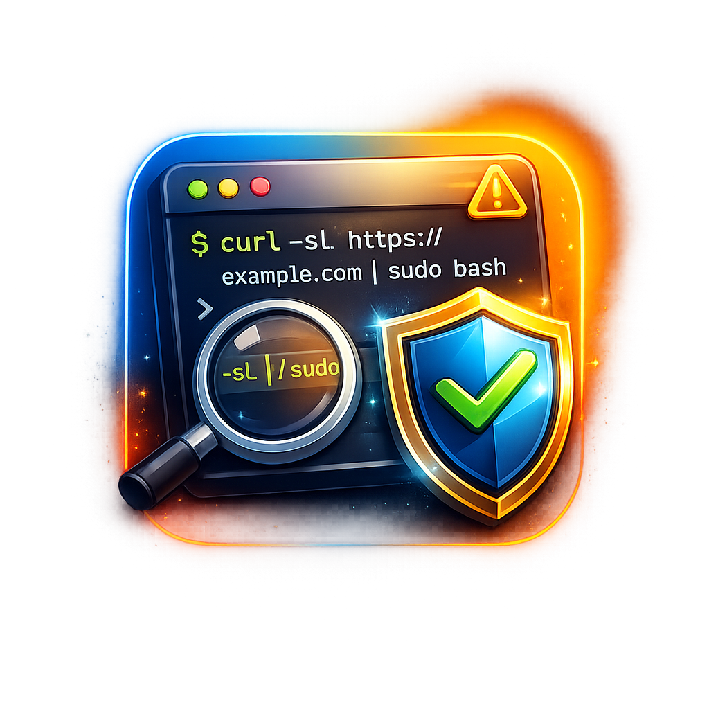

<p align="center">
  
  <h1 align="center">cmd-explain</h1>
  <p align="center">
    Know what every shell command does — before you approve it.
    <br />
    <strong>MCP server for AI coding agents · Works with Kiro, Cursor, VS Code, Windsurf, Claude Code</strong>
    <br /><br />
    <a href="README.md">English</a> | <a href="README.zh-CN.md">中文</a>
  </p>
</p>

<p align="center">
  <a href="#quick-start">Quick Start</a> ·
  <a href="#how-it-works">How It Works</a> ·
  <a href="#supported-ides">Supported IDEs</a> ·
  <a href="#optional-local-ai">Local AI</a>
</p>

---

## The Problem

AI coding agents run shell commands on your machine. They show an approval dialog, but you're left guessing:

```
Agent wants to run:  curl -sL https://raw.githubusercontent.com/some-tool/install.sh | sudo bash

  [ Approve ]   [ Deny ]
```

Is that safe? What does `-sL` mean? Why `sudo`? Most people either blindly approve (dangerous) or Google it (slow, breaks flow).

## The Fix

cmd-explain intercepts every shell command **before** it runs and shows you a plain-English explanation with a risk rating:

```
🔴 Transfer data from or to a URL (silent, follow redirects),
   then GNU Bourne-Again SHell
   Risk: high · Source: built-in

Agent wants to run:  curl -sL https://raw.githubusercontent.com/some-tool/install.sh | sudo bash

  [ Approve ]   [ Deny ]
```

Now you know: it silently downloads a script and pipes it to bash with root privileges. That's a one-line rootkit vector. Easy deny — or at least worth inspecting first.

## More Examples

Commands that agents actually suggest — and that you'd probably approve without thinking:

```
🔴 chmod -R 777 .
   Change file permissions (recursive)
   Risk: high · Source: built-in
   → Makes every file in your project world-writable

🟡 curl -sL https://install.example.com | bash
   Transfer data from or to a URL (silent, follow redirects),
   then GNU Bourne-Again SHell
   Risk: medium · Source: built-in
   → Downloads and executes a remote script. Classic supply chain risk.

🔴 git push origin main --force
   Upload local commits to a remote (force push, set upstream)
   Risk: high · Source: built-in
   → Overwrites remote history. Other people's commits may be lost.

🔴 rm -rf node_modules dist .next .cache && npm ci
   Remove files or directories (recursive, force without confirmation),
   then clean install from lockfile
   Risk: high · Source: built-in

🟡 npx prisma db push --accept-data-loss
   Run a command from a local or remote npm package without installing
   Risk: medium · Source: built-in
   → That --accept-data-loss flag means exactly what it says.

🔴 kubectl exec -it prod-db-0 -- psql -c "DROP TABLE users"
   Execute a command in a container
   Risk: high · Source: built-in
   → Running SQL directly on a production pod.
```

Every explanation includes:
- **What it does** in plain English, including flags and shell patterns (`2>&1`, `|| true`, `>/dev/null`)
- **Risk level** — low (read-only), medium (state-changing), high (destructive), or unknown
- **Source** — `built-in` (241-command dictionary), `system` (man pages), or `ai-generated` (LLM)

## Quick Start

```bash
npx cmd-explain setup
```

That's it. Auto-detects your IDE, installs the MCP server, creates the pre-command hook. Restart your IDE and you're protected.

**Requirements:** Node.js 18+. No API keys, no Ollama, no config files to edit.

</text>
</invoke>

## How It Works

cmd-explain is an [MCP server](https://modelcontextprotocol.io/) with one tool: `explain_command`. When your agent is about to run a shell command, a pre-command hook calls this tool automatically.

Explanations come from three tiers, checked in order:

| Tier | Source | Speed | Coverage | Needs Setup? |
|------|--------|-------|----------|-------------|
| 1 | **Built-in dictionary** — 240+ programs with 440+ command explanations (git, docker, npm, kubectl, terraform, aws, brew, cargo, and more) | <1ms | ~90% of agent commands | No |
| 2 | **System man pages** — parses `whatis` output for any installed CLI tool | ~50ms | Most installed tools | No |
| 3 | **Local AI** — Ollama, OpenAI, or Anthropic for anything tiers 1–2 miss | ~1s | Everything | Optional |

Tiers 1 and 2 are fully offline with zero dependencies. Tier 3 is opt-in.

### Shell Pattern Detection

cmd-explain understands shell syntax that agents commonly use:

| Pattern | Annotation |
|---------|-----------|
| `2>&1` | redirect stderr to stdout |
| `>/dev/null 2>&1` | suppress all output |
| `2>/dev/null` | suppress error output |
| `\|\| true` | ignore exit code |
| `set -e` | exit on error |
| `set -x` | print commands before execution |
| `set -o pipefail` | fail on any pipe segment error |
| `$(...)` | command substitution |

These are appended to the explanation so you always know what the full command is doing.

### Risk Classification

| Level | Meaning | Examples |
|-------|---------|---------|
| 🟢 low | Read-only, no side effects | `ls`, `cat`, `grep`, `git status`, `curl GET` |
| 🟡 medium | State-changing but reversible | `git commit`, `npm install`, `mkdir`, `docker build` |
| 🔴 high | Destructive or irreversible | `rm -rf`, `docker rm -f`, `terraform destroy`, `find -delete` |
| ⚪ unknown | Not recognized | Custom/proprietary CLIs |

## Supported IDEs

One setup command handles everything. Each IDE gets the right hook format automatically.

| IDE | Hook Event | Shell Coverage |
|-----|-----------|---------------|
| **Kiro** | `preToolUse` | ✅ All shell commands |
| **VS Code Copilot** | `PreToolUse` | ✅ All shell commands |
| **Cursor** | `beforeShellExecution` | ✅ Dedicated shell hook |
| **Windsurf** | `pre_run_command` | ✅ Dedicated shell hook |
| **Claude Code** | `PreToolUse` | ✅ Via matcher |

```bash
npx cmd-explain setup              # Auto-detect all IDEs
npx cmd-explain setup --ide kiro   # Target one IDE
npx cmd-explain setup --no-hooks   # MCP server only
```

## Optional: Local AI

For commands not in the dictionary or man pages, enable local AI explanations powered by Ollama (~1GB one-time download):

```bash
brew install ollama
brew services start ollama
ollama pull qwen2.5-coder:1.5b
npx cmd-explain setup --ollama qwen2.5-coder:1.5b
```

The setup command validates each step — if Ollama isn't installed or the model isn't pulled, it tells you exactly what to run.

Cloud APIs also work:

```bash
npx cmd-explain setup --openai-key sk-...
```

Supported providers: Ollama, OpenAI (`OPENAI_API_KEY`), Anthropic (`ANTHROPIC_API_KEY`).

## Manual Install

Add to your IDE's MCP config:

```json
{
  "mcpServers": {
    "cmd-explain": {
      "command": "npx",
      "args": ["-y", "cmd-explain"]
    }
  }
}
```

Config locations:
- **Kiro:** `.kiro/settings/mcp.json`
- **VS Code:** `.vscode/mcp.json`
- **Cursor:** `.cursor/mcp.json`
- **Windsurf:** `~/.codeium/windsurf/mcp_config.json`
- **Claude Code:** `~/.claude/settings.json`

## Uninstall

```bash
npx cmd-explain uninstall
```

Removes the MCP config and hook files from all detected IDEs. Clean removal, nothing left behind.

## Platform Support

| | macOS | Linux | Windows |
|-|-------|-------|---------|
| Dictionary (Tier 1) | ✅ | ✅ | ✅ |
| Man pages (Tier 2) | ✅ | ✅ | ⚠️ `--help` only |
| Local AI (Tier 3) | ✅ | ✅ | ✅ |
| Setup CLI | ✅ | ✅ | ✅ |

## License

MIT
